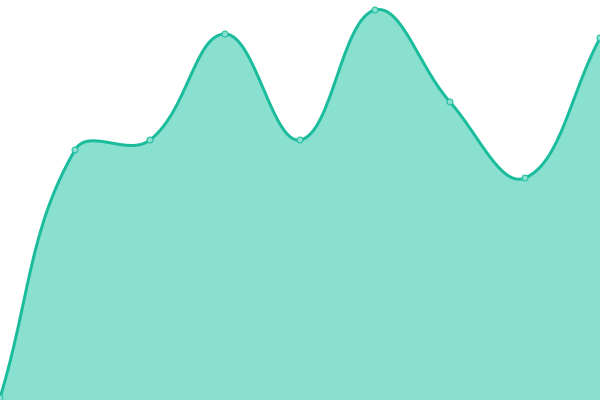
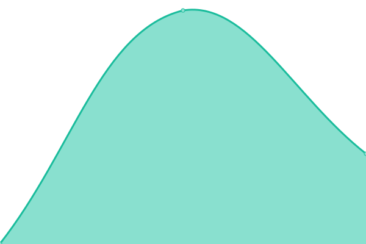

# [📈 Live Status](https://status.worldwidepixel.ca): <!--live status--> **🟩 All systems operational**

This repository contains the open-source uptime monitor and status page for [worldwidepixel](worldwidepixel.ca), powered by [Upptime](https://github.com/upptime/upptime).

With [Upptime](https://upptime.js.org), you can get your own unlimited and free uptime monitor and status page, powered entirely by a GitHub repository. We use [Issues](https://github.com/worldwidepixel/status/issues) as incident reports, [Actions](https://github.com/worldwidepixel/status/actions) as uptime monitors, and [Pages](https://status.worldwidepixel.ca) for the status page.

<!--start: status pages-->
<!-- This summary is generated by Upptime (https://github.com/upptime/upptime) -->
<!-- Do not edit this manually, your changes will be overwritten -->
<!-- prettier-ignore -->
| URL | Status | History | Response Time | Uptime |
| --- | ------ | ------- | ------------- | ------ |
|  [Main Website](https://worldwidepixel.ca) | 🟩 Up | [main-website.yml](https://github.com/worldwidepixel/status/commits/HEAD/history/main-website.yml) | 

 361ms
     
 | 

<a href="https://status.worldwidepixel.ca/history/main-website">100.00%</a>
    

|  [Badger Legacy (v1)](https://badger.worldwidepixel.ca) | 🟩 Up | [badger-legacy-v1.yml](https://github.com/worldwidepixel/status/commits/HEAD/history/badger-legacy-v1.yml) | 

 165ms
     
 | 

<a href="https://status.worldwidepixel.ca/history/badger-legacy-v1">100.00%</a>
    

|  [Badger v2 (staging)](https://v2.badger.worldwidepixel.ca) | 🟩 Up | [badger-v2-staging.yml](https://github.com/worldwidepixel/status/commits/HEAD/history/badger-v2-staging.yml) | 

 181ms
     
 | 

<a href="https://status.worldwidepixel.ca/history/badger-v2-staging">100.00%</a>
    

|  [Badger v2 API (staging)](https://badger-api-staging.worldwidepixel.ca) | 🟩 Up | [badger-v2-api-staging.yml](https://github.com/worldwidepixel/status/commits/HEAD/history/badger-v2-api-staging.yml) | 

 231ms
     
 | 

<a href="https://status.worldwidepixel.ca/history/badger-v2-api-staging">100.00%</a>
    

|  [Badger v3 (staging)](https://v3.badger.worldwidepixel.ca) | 🟩 Up | [badger-v3-staging.yml](https://github.com/worldwidepixel/status/commits/HEAD/history/badger-v3-staging.yml) | 

 268ms
     
 | 

<a href="https://status.worldwidepixel.ca/history/badger-v3-staging">100.00%</a>
    

|  [Badger v3 API (staging)](https://api.v3.badger.worldwidepixel.ca) | 🟩 Up | [badger-v3-api-staging.yml](https://github.com/worldwidepixel/status/commits/HEAD/history/badger-v3-api-staging.yml) | 

 168ms
     
 | 

<a href="https://status.worldwidepixel.ca/history/badger-v3-api-staging">100.00%</a>
    

|  [StatsView](https://stats.worldwidepixel.ca) | 🟩 Up | [stats-view.yml](https://github.com/worldwidepixel/status/commits/HEAD/history/stats-view.yml) | 

 160ms
     
 | 

<a href="https://status.worldwidepixel.ca/history/stats-view">100.00%</a>
    

|  [Modwrapped](https://badger.worldwidepixel.ca) | 🟩 Up | [modwrapped.yml](https://github.com/worldwidepixel/status/commits/HEAD/history/modwrapped.yml) | 

 123ms
     
 | 

<a href="https://status.worldwidepixel.ca/history/modwrapped">100.00%</a>
    

<!--end: status pages-->

[**Visit our status website →**](https://status.worldwidepixel.ca)

## 📄 License

- Powered by: [Upptime](https://github.com/upptime/upptime)
- Code: [MIT](./LICENSE) © [Anand Chowdhary](https://anandchowdhary.com), supported by [Pabio](https://pabio.com)
- Data in the `./history` directory: [Open Database License](https://opendatacommons.org/licenses/odbl/1-0/)
